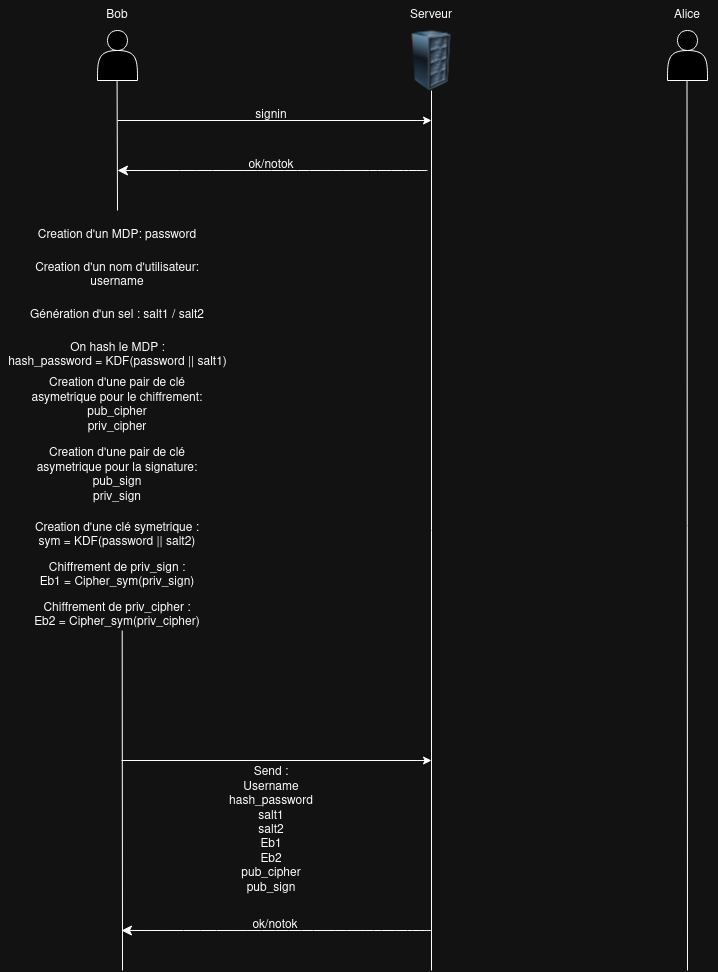
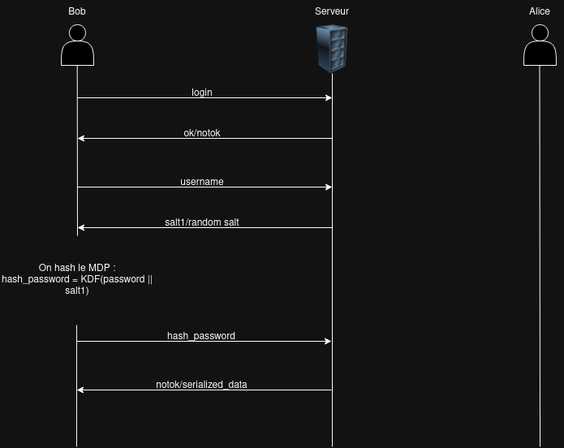
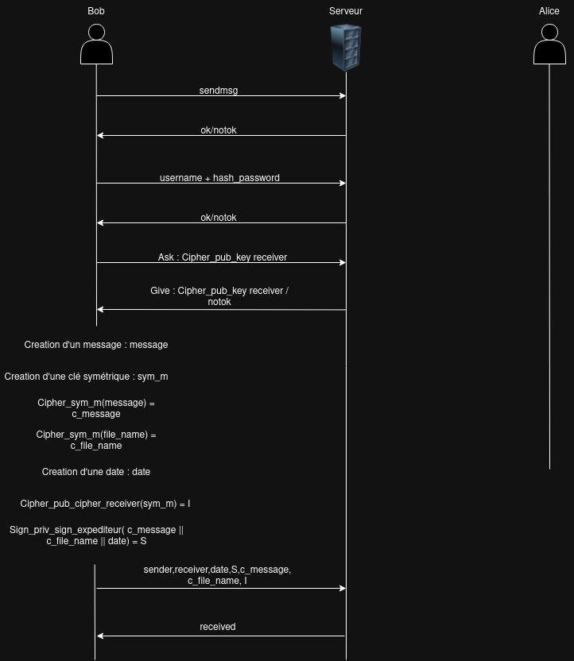
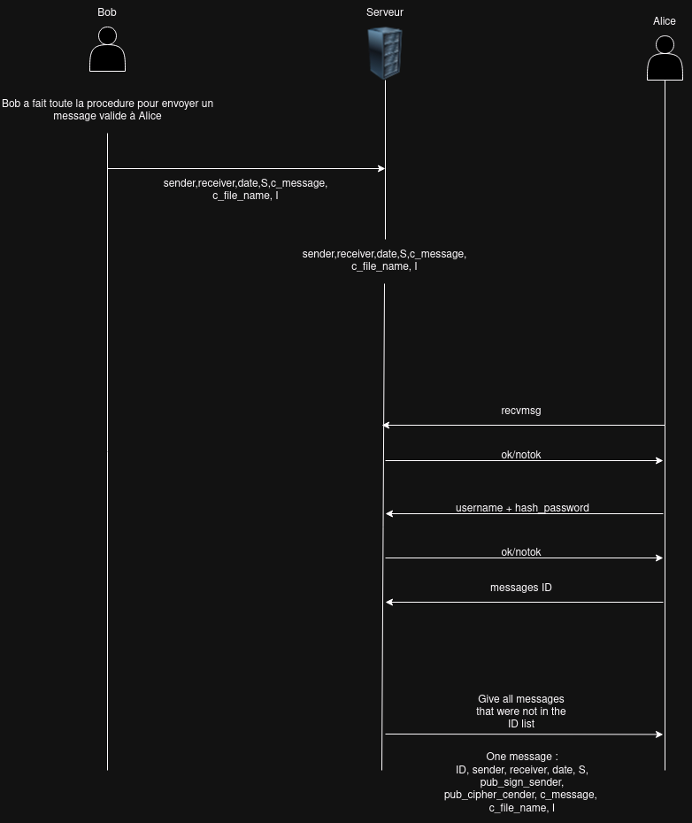
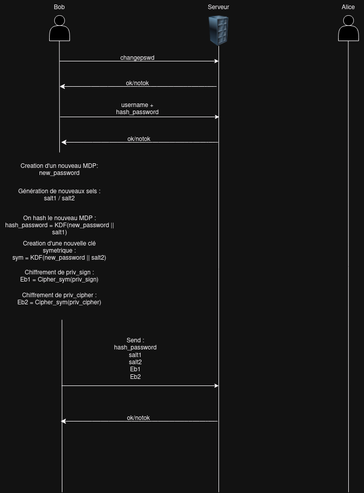
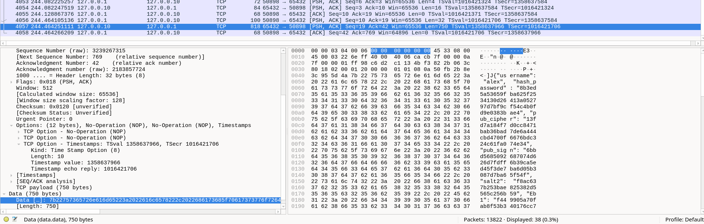
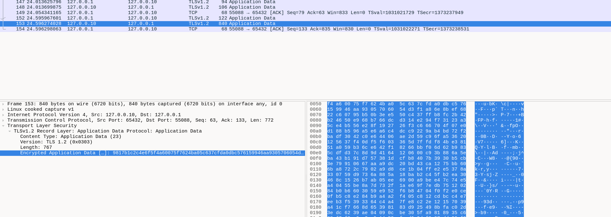

# CAA-Projet - DelayPost

Implémentation cryptographique d'une messagerie dans le futur

# Spécifications du projet

## Objectif principal :

Créer une application permettant aux utilisateurs d'envoyer des messages qui ne peuvent être déchiffrés qu'après une date spécifiée dans le futur.

## Spécifications fonctionnelles :

### Authentification des utilisateurs :
Les utilisateurs doivent se connecter avec un simple nom d'utilisateur et un mot de passe.
Possibilité de changer le mot de passe.
Accès à leur compte depuis n'importe quel appareil.

### Gestion des messages :
Les utilisateurs peuvent envoyer des messages confidentiels à d'autres utilisateurs.
Les messages doivent être lisibles par le destinataire uniquement après une date prédéfinie (qui peut être passée ou future).
Le destinataire doit pouvoir connaître à tout moment la date de déverrouillage.
Les messages peuvent contenir des fichiers volumineux (vidéos, jeux, etc.).
Les fichiers peuvent être téléchargés avant la date de déverrouillage, mais restent chiffrés jusqu'à la date spécifiée.
Une dernière interaction courte avec le serveur est autorisée pour déchiffrer.

### Authentification des expéditeurs :
L'expéditeur doit être authentifié et ne doit pas pouvoir nier l'envoi du message (non-répudiation).

### Adversaire :
Adversaires actifs envisagés.
Le serveur est honnête mais curieux : il respecte le protocole tout en tentant de compromettre la confidentialité des messages.

### Évolutivité :
Le système doit gérer un grand nombre d'utilisateurs (potentiellement des millions).
Minimisation des ressources utilisées par le serveur pour chiffrer les fichiers.

### Interface utilisateur :
Les options de l'interface incluent :
- Envoyer un message.
- Lire les messages reçus (avec détails sur les dates de déverrouillage et expéditeurs).
- Changer de mot de passe.

# Organisation du code

Ce projet est divisé en deux grandes catégories : le **client** et le **serveur**, chacun étant conçu pour accomplir des tâches spécifiques liées à l'application.

---

### 1. Côté Client
Le client est responsable de l'interface utilisateur et de la gestion locale des données avant leur envoi au serveur.

#### Principaux fichiers et responsabilités
1. **`client.py`**
   - Point d'entrée principal pour le client.
   - Gère la connexion au serveur via socket.
   - Menu principal pour se connecter, s'inscrire, ou quitter.
   - Dirige les utilisateurs connectés vers des fonctionnalités comme l'envoi de messages ou la modification du mot de passe.

2. **`clientCommunication.py`**
   - Gère l'interaction avec le serveur (envoi/réception de messages, connexion, modification de mot de passe).
   - Sécurise les données avant leur envoi grâce à des mécanismes cryptographiques.
   - Principales fonctions :
     - `sign_in`: Inscription d'un nouvel utilisateur avec génération des clés nécessaires.
     - `login`: Authentification d'un utilisateur existant.
     - `send_message`: Chiffrement et envoi d'un message à un destinataire spécifique.
     - `receive_message`: Déchiffrement des messages reçus.
     - `change_password`: Permet à l'utilisateur de modifier son mot de passe.
     - `receive_keys` : Permet de recuperer les clés pour déchiffrer les messages

3. **`communication_utils.py`**
   - Implémente des fonctions utilitaires pour tester les sockets et gérer les fichiers :
     - `process_file`: Chiffre ou déchiffre un fichier selon les besoins.
     - `test_socket`: Vérifie si le socket client est fonctionnel.

4. **`crypto_utils.py`**
   - Contient des fonctions pour la dérivation de clés (KDF) et le traitement des hachages.
   - `KDF`: Dérive une clé sécurisée à partir d'un mot de passe et d'un sel.
   - `hash_extruder`: Extrait un hachage spécifique du format Argon2.

5. **`user_input.py`**
   - Collecte les données utilisateur pour l'inscription, la connexion, et d'autres interactions.
   - Affiche les menus et gère les choix des utilisateurs.

6. **`time_utils.py`**
   - Permet aux utilisateurs d'entrer une date et une heure dans un format précis.
   - Garantit que les dates respectent le format ISO.

---

### 2. Côté Serveur
Le serveur centralise les données des utilisateurs et des messages. Il assure l'authentification, le stockage et la distribution des messages.

#### Principaux fichiers et responsabilités
1. **`server.py`**
   - Point d'entrée principal pour le serveur.
   - Configure et écoute les connexions client.
   - Dirige les demandes vers les gestionnaires appropriés (login, inscription, envoi/réception de messages).

2. **`serverCommunication.py`**
   - Contient la logique pour gérer chaque type de demande client :
     - `sign_in_handler`: Inscription d'un utilisateur avec validation des données.
     - `login_handler`: Authentification des utilisateurs avec vérification des hachages.
     - `message_handler`: Gère la réception et le stockage des messages chiffrés.
     - `send_messages`: Récupère les messages pour un destinataire spécifique en fonction des dates.
     - `send_keys`: Fournit les clés de déchiffrement si les conditions sont remplies.
     - `change_password`: Met à jour les informations d'authentification d'un utilisateur.

3. **`database.py`**
   - Gère le stockage des informations utilisateur dans un fichier JSON.
   - Assure la sécurité des données avec des verrous pour prévenir les problèmes de concurrence.

4. **`message_database.py`**
   - Gère le stockage des messages dans une base de données JSON.
   - Fournit des fonctions pour ajouter et récupérer les messages en fonction de critères spécifiques (destinataire, date).

# Implémentation

## Création de compte (sign_in)

Lors de la création du compte, deux valeurs sont requises de la part de l'utilisateur :

- Un nom d'utilisateur => username
- Un mot de passe  => password

Un contrôle effectué par le serveur permet de vérifier si le nom d'utilisateur est déjà utilisé.

Nous aurons également besoin de deux sels qui seront générés par notre programme :

1. Pour le hashage du mot de passe de l'utilisateur. Ce hash est utilisé pour l'authentification => salt1
2. Pour la dérivation de la clé symetrique => salt2

Une fois que nous disposons de nos deux valeurs de sel, nous générerons les clés nécessaires pour écrire et recevoir des messages :
- Le hash pour l'authentification => KDF(password || salt1) = hash_password
- Une paire de clé asymetrique pour le chiffrement => pub_cipher / priv_cipher
- Une paire de clé asymetrique pour la signature des messages => pub_sign / priv_sign
- Une clé symetrique dérivée du mot de passe utilisateur => KDF(password || salt2) = sym

On va chiffrer :
- La clé privée de signature par la clé symetrique => Cipher_sym(priv_sign) = Eb1
- La clé privée de Chiffrement par la clé symetrique => Cipher_sym(priv_cipher) = Eb2

On envoit au serveur :
- Username
- Hash_password
- salt1
- salt2
- Eb1
- Eb2
- pub_cipher
- pub_sign

Le serveur reçoit les données et les stocke dans une base de données au format JSON.

Cette stratégie a été adoptée car, selon la spécification, le serveur est considéré comme honnête mais curieux. Cela signifie qu'il respectera les protocoles, mais tentera de compromettre la confidentialité des données s'il en a l'opportunité. C'est pourquoi il est crucial de protéger toutes les informations confidentielles, telles que les clés privées de chiffrement et de signature et bien évidemment les messages.

La seule information que le serveur ne possède pas est le mot de passe utilisateur en clair. Toute la sécurité repose donc sur ce mot de passe. Le `hash_password` est utilisé uniquement pour l'authentification et donc si le serveur le connait, cela ne pose aucun problème. En revanche, la clé symétrique `sym` ne doit jamais être transmise au serveur, afin de garantir la confidentialité des données.

Les sels sont utilisés pour recalculer le `hash_password` et la clé symétrique `sym` lors de la connexion depuis un nouvel appareil. Même si le serveur possède le `hash_password` et son sel correspondant, il lui sera très difficile de retrouver le mot de passe en clair, grâce à la robustesse de la fonctions de hachage et à l'utilisation de sel fort.

En ce qui concerne les clés publiques, le serveur ne peut pas en faire grand-chose, si ce n'est vérifier les signatures des messages ou chiffrer et envoyer un message, ce qui dans aucun cas pose un problème de confidentialité.

## Connexion au compte (login)

L'utilisateur envoit dans un premier temps son nom d'utilisateur au serveur. 

Lorsque le serveur reçoit le nom d'utilisateur, il transmet le sel correspondant au client. Si le compte n'existe pas, le serveur génère et envoie un sel aléatoire au client. Cette méthode permet de prévenir les attaques par énumération des utilisateurs.

Une fois le sel reçu, le client peut reconstituer le hachage du mot de passe et le transmettre au serveur pour s'authentifier.

Si le mot de passe haché ne correspond pas à celui stocké dans la base de données du serveur, la procédure de connexion est stoppée.

Si le mot de passe correspond, l'utilisateur est authentifié et les informations nécessaires pour déchiffrer ou envoyer des messages lui sont transmises :

- Son nom d'utilisateur => username
- Son mot de passe hashé => hash_password
- Sa clé publique de chiffrement => pub_cipher
- Sa clé publique de signature => pub_sign
- Le sel pour récuper la clé symetrique => salt2
- Le cipher de la clé privée de chiffremeent et de la signature => Eb1 / Eb2

Cette approche garantit que, quel que soit l'appareil utilisé par l'utilisateur pour se connecter, il disposera toujours des éléments nécessaires pour recevoir, lire et envoyer ses messages.

## Envois de message (send_message)

Pour exécuter cette fonction, l'utilisateur doit être authentifié, c'est-à-dire être en possession d'un nom d'utilisateur et d'un mot de passe haché valides. Ces informations doivent être transmises à chaque appel de la fonction.

Voici les étapes pour l'envois d'un message dans le future :

1. On commence par demander à qui le message doit être envoyé. Cette étape est essentielle, car elle permet de demander la clé publique de l'utilisateur cible auprès du serveur. Elle sert également à vérifier que le destinataire est bien un utilisateur valide.
2. On crée notre message (ici ça sera un fichier qui contient un texte) => message
3. On génère une clé symétrique pour chiffrer le message. À chaque envoi de message, une nouvelle clé est créée. => sym_m
4. On chiffre le contenu du fichier ainsi que son nom avec la clé symétrique `sym_m` créée précédemment.  => c_message , c_file_name
5. On définit une date à laquelle le message peut être déchiffré. Si cette date est dans le passé, le destinataire pourra le lire dès sa réception. => date
6. Avec la clé publique du destinataire, on chiffre la clé symétrique sym_m utilisée pour chiffrer le message. Cette méthode empêche le serveur d'utiliser la clé sym_m pour déchiffrer le message, car il ne possède pas la clé privée nécessaire pour déchiffrer `sym_m`. => Cipher_pub_cipher_receiver(sym_m) = I
7. Pour la signature, celle-ci se déroule en deux étapes. Dans un premier temps, on concatène le message chiffré, le nom du fichier chiffré, et la date à laquelle le message peut être lu. Le résultat de la concaténation est passé dans une fonction de hachage afin d'avoir une sortie constante. Puis, on signe le hash avec la clé privée de l'expediteur => S

Cette méthode permet de garantir la non-répudiation, l'authentification et l'intégrité du message reçu. En effet, si le message ou la signature est modifié, il devient impossible de vérifier la validité de la signature. 

8. Pour finir, on transmet au serveur :
- Le nom de l'expediteur => sender
- Le nom du destinataire => receiver
- La date à laquelle on peut lire le message => date
- La signature => s
- Le message chiffré => c_message
- Le nom du fichié chiffré => c_file_name
- La clé utilisée pour chiffrer le message et le nom du fichier est elle-même chiffrée => cipher_sym_key

À la réception d'un message, le serveur attribue un ID unique au message et le stocke dans une base de données dédiée aux messages, au format JSON.

## Réception du message (receive_message)

Pour exécuter cette fonction, l'utilisateur doit être authentifié, c'est-à-dire être en possession d'un nom d'utilisateur et d'un mot de passe haché valides. Ces informations doivent être transmises à chaque appel de la fonction.

La personne ayant reçu un message peut le télécharger à tout moment depuis le serveur. Toutefois, elle ne reçoit pas immédiatement la clé permettant de déchiffrer le contenu. Cette clé lui est transmise uniquement lorsque la date spécifiée est atteinte. Dans le code, cela équivaut à avoir la valeur None à l'emplacement de cipher_sym_key. Un message est également affiché pour indiquer quand le message pourra être déchiffé.

La personne ayant reçu le message peut également récupérer la clé publique de signature de l'expéditeur pour contrôler la signature.

Le contrôle de la signature s'effectue en deux étapes. D'abord on contrôle que la signature du message provient bien de l'expéditeur. 

Ensuite, on vérifie que le message signé correspond exactement à celui qui a été reçu. Pour cela, on hache la concaténation du message chiffré, du nom du fichier chiffré, et de la date, puis on compare le résultat avec le hachage contenu dans la signature. Si la signature n'est invalide pas, le message n'est pas déchiffré.

Le serveur transmet au client :
- L'id du message 
- Le nom de l'expediteur
- Le nom du destinataire
- La date de déchiffrement
- La signature du message
- Les clés publiques de signature et de chiffrement de l'expediteur
- Le message chiffré
- Le nom du fichier chiffré
- La clé symetrique chiffré pour déchiffrer le message et le nom du fichier

Le contrôle de la date est effectué côté serveur. Si la date de déchiffrement est dans le futur, la clé symétrique ne sera pas envoyée.

Côté client, les messages déjà reçus sont mémorisés à l’aide de leur ID. Cela permet de ne télécharger que les messages non encore reçus. Lors de chaque appel de fonction, cette liste d’ID est envoyée au serveur, qui répond uniquement avec les messages ne figurant pas dans la liste.
Cette mémoire est réinitialisée à chaque fermeture du programme.

## Changement de mot de passe (change_password)

Pour exécuter cette fonction, l'utilisateur doit être authentifié, c'est-à-dire être en possession d'un nom d'utilisateur et d'un mot de passe haché valides. Ces informations doivent être transmises à chaque appel de la fonction.

Le changement de mot de passe s'effectue en plusieurs étapes. Tout d'abord, deux nouveaux sels sont générés : l'un pour le `hash_password` et l'autre pour la clé symétrique `sym`.

Ensuite, la fonction de dérivation est utilisée pour créer le nouveau hash => KDF(new_password || new_sal1) = hash_password

La fonction de dérivation est ensuite utilisée pour générer une nouvelle clé symétrique, qui sera utilisée pour chiffrer les clés privées => KDF(new_password || new_salt2) = sym

Les clés privées de signature et de chiffrement sont alors chiffrées à l'aide de la nouvelle clé symétrique  => Cipher_sym(priv_sign) = Eb1 / Cipher_sym(priv_cipher) = Eb2

Une fois ces étapes terminées, les données peuvent être renvoyées au serveur  :
- Le nouveau hash => hash_password
- Le nouveau sel pour le hash du mot de passe => salt1
- Le nouveau sel de la clé symetrique => salt2
- Le cipher de la clé privée de chiffrement par la clé symetrique => Eb1
- Le cipher de la clé privée de signature par la clé symetrique => Eb2

Le serveur prend ensuite en charge la mise à jour de sa base de données des utilisateurs avec les nouvelles informations.

Cette méthode garantit que les clés les plus importantes (les clés asymétriques) restent inchangées lors des modifications de mot de passe. Ainsi, il sera toujours possible de chiffrer et de signer des messages en utilisant les mêmes clés.

## Demande de clé (receive_keys)

Pour exécuter cette fonction, l'utilisateur doit être authentifié, c'est-à-dire être en possession d'un nom d'utilisateur et d'un mot de passe haché valides. Ces informations doivent être transmises à chaque appel de la fonction.

Cette fonction est similaire à la fonction `receive_message`. Elle permet de récupérer les clés des messages encore chiffrés qui ont déjà été téléchargés. Après la récupération de la clé, la fonction assure également le déchiffrement du message.

Dans cette fonction, le contrôle de la signature du message n'est pas effectué, car cette vérification a déjà été réalisée au préalable dans la fonction `receive_message`.

Cette fonction permet, entre autres, de savoir quand un message téléchargé pourra être déchiffré. 

# Detail d'implementation cryptographique

## Parametres

J'ai suivi les recommandations de l'ANSSI concernant la taille des paramètres cryptographiques. Les choix ont été alignés sur les projections pour l'année 2030, telles qu'indiquées sur le site *keylength.com*.

Ce qui me donne les paramètres recommandés suivants :

|    Date   | Symmetric | Factoring Modulus| Key | Group | Elliptic Curve |    Hash   |
|-----------|-----------|------------------|-----|-------|----------------|-----------|
| > 2030    |    128    |       3072       | 200 | 3072  |       256      |     256   |

Ce sont les paramètres que j'ai choisis, mais comme la bibliothèque PyNaCl intègre déjà toutes les mesures de sécurité nécessaires, je ne vais pas m'en tenir strictement à ces valeurs. Je vérifierai plutôt que les valeurs utilisées par la bibliothèque sont égales ou supérieures aux recommandations.

## Algorithme de chiffrement

### Symetrique

Pour le chiffrement symétrique, j'utilise la bibliothèque PyNaCl, qui implémente XChaCha20 pour le chiffrement au sein de la classe Aead, ainsi que Poly1305 comme mécanisme de contrôle d'intégrité (MAC).

XChaCha20-Poly1305 est une variante de l'algorithme de chiffrement authentifié ChaCha20-Poly1305, conçue pour renforcer la sécurité grâce à l'utilisation d'un nonce (valeur unique utilisée une seule fois) plus long.

- La clé symétrique a une taille de 256 bits.
Dans notre implémentation, cette clé est dérivée du mot de passe de l'utilisateur à l'aide de la fonction de dérivation de clés Argon2id. Le sel utilisé pour générer la clé est produit par la fonction os.urandom, qui est cryptographiquement sûre.
  
- Le nonce mesure 192 bits.
- Le compteur à une taille de 64 bits.
- La taille du bloc est de 512 bits.

La gestion du nonce, du compteur et de tous les paramètres autres que la clé symétrique et le sel est déléguée à la classe Aead de PyNaCl, considérée comme sûre.

### Asymetrique

Le chiffrement asymétrique s'effectue sur la courbe elliptique Curve25519, mise en œuvre dans la classe Box de la bibliothèque PyNaCl.

- Les clés (publique/privée) ont une taille de 256 bits chacune.
- Le nonce généré mesure 192 bits (sa génération et sa gestion sont automatiquement prises en charge par la classe Box).
- Le tag d'authentification à une taille de 128 bits (son utilisation est entièrement gérée en interne par la classe Box).

À l'exception de la gestion des clés, l'ensemble des opérations de chiffrement et de gestion des paramètres est délégué à la classe Box de PyNaCl, considérée comme sûre.

## Algorithme de signature

Pour l'algorithme de signature, j'utilise EdDSA, et plus précisément son implémentation Ed25519, qui est réalisée dans la classe SigningKey de la bibliothèque PyNaCl :

- La taille des clés(publique/privée) est de 256 bits
- La taille du seed est de 256 bits

## Algorithme dérivation de clé

Argon2 est un algorithme de dérivation de clés conçu pour le hachage sécurisé des mots de passe. Il est réputé pour sa robustesse et a été désigné gagnant du concours Password Hashing Competition (PHC) en 2015. Argon2 est spécialement conçu pour résister aux attaques par force brute, notamment celles effectuées à l'aide de matériel spécialisé comme les GPU et ASIC.

Il y a trois variantes principales d'Argon2 : 
- Argon2d : Optimisé pour résister aux attaques utilisant beaucoup de matériel, mais plus vulnérable aux attaques par canal auxiliaire
- Argon2i : Optimisé pour résister aux attaques par canal auxiliaire, notamment les attaques de type cache timing.
- Argon2id : Combine les forces des deux précédents et est recommandé pour la plupart des applications.

Dans ce projet, j'utilise la variante Argon2id de la bibliothèque argon2-cffi :

- La taille du sel est de 128 bits, et il est généré manuellement afin de pouvoir être stocké ultérieurement.
- La taille de la clé ou du hachage est de 256 bits, afin de garantir la compatibilité avec les exigences de la bibliothèque PyNaCl.

Étant donné que tous les hachages sont effectués côté client et que le serveur n'a pas à supporter la charge des calculs, j'ai choisi d'augmenter la valeur des paramètres pour renforcer la sécurité :

- Pour le nombre de thread. Par défaut il y en a 4, j'ai mis 5 threads
- Pour le cout mémoire,la valeur reste inchangé. 65536 kibibyte.
- Le nombre d'iteration (time_cost). Par defaut il y est a 1, j'ai mis a 20
- Le cout en temps est de 0,5 sec en moyenne.

Des tests préalables ont été effectués localement sur mon ordinateur pour valider le fonctionnement.

# Amélioration de l'application 

## 1 Mise en place d'un tunnel TLS

Lors de la connexion, un canal SSL/TLS est établi entre le serveur et le client. L'échange est configuré pour sélectionner automatiquement la version la plus récente du protocole, en fonction des capacités respectives du client et du serveur, conformément aux recommandations de la bibliothèque SSL.

Cela permet de respecter la contrainte de protection contre les adversaires actifs. Étant donné que TLS assure l'authentification du serveur auprès du client (via la mise en place de certificats), la confidentialité des communications (voir capture wireshark) et l'intégrité des données, il constitue une solution robuste et complète.

Avec Wireshark, on peut observer qu'avant l'établissement d'une connexion sécurisée, toutes les données circulant sur le réseau étaient lisibles en clair :

Une fois le protocole TLS mis en place, on peut constater que les données échangées sont chiffrées, rendant leur lecture impossible sans les clés appropriées :

Pour la mise en place des certificats, j'ai suivi le modèle présenté lors du cours de cryptographie. Concrètement, un certificat racine (root) est préinstallé chez le client (simulé ici par la présence du certificat dans le répertoire `code/certif/client`). La clé privée associée au certificat racine est utilisée pour signer le certificat intermédiaire, qui, à son tour, signe le certificat destiné au serveur. Ce dernier est utilisé par le serveur pour s'authentifier auprès des clients.

